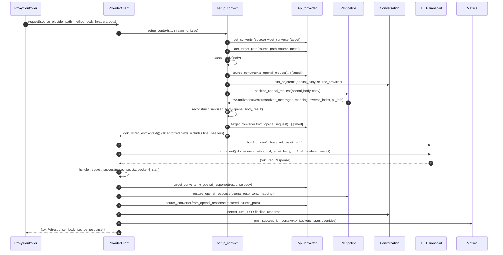
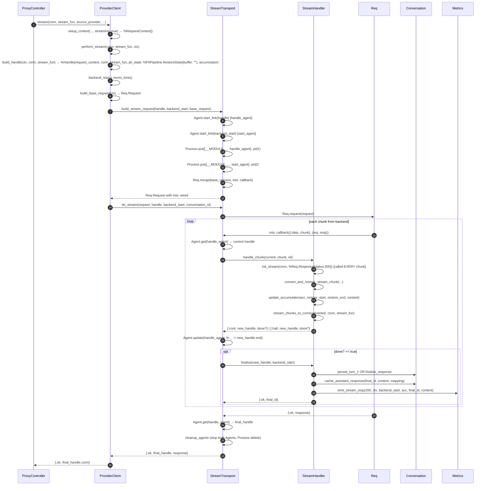

# 06 — ProviderClient Logic & Data Flow Review

A walkthrough of `ProviderClient`'s `request/6` and `stream/8` paths, with
mermaid diagrams, followed by a catalogue of accidental complexity
introduced or left behind by the #13–#21 deepening programme, and a
proposed cleanup plan.

---

## Part 1 — The Flow

Both entry points share `setup_context/6`, which builds a `%RequestContext{}`
carrying the post-preparation request state. The two paths then diverge:
the sync path does one HTTP call and reverses the pipeline; the stream path
runs a chunked reduce driven by Req's `into:` callback.

### 1.1 Sync request path (`request/6`)



**Notes on the sync path:**

- `backend_start` is **not captured directly**. It is reconstructed by
  `compute_backend_start/1` as `started.monotonic + pii_duration +
  source_conversion_duration + target_conversion_duration`. The stream path
  captures it directly with `mono_time()`. Inconsistent and fragile.
- `emit_success_for_context/2` and `emit_error_for_context/2` are the
  context-aware Metrics helpers used here. The stream error path does **not**
  use them (see below).

### 1.2 Stream path (`stream/8`)



**Notes on the stream path:**

- Two `Agent` GenServers are spawned per stream request just to hold an
  immutable struct and an integer across `into:` callback invocations. Req's
  `into:` callback runs **in the caller's process** (confirmed by
  `stream_transport_test.exs:50` using `self()`), so `Process.put`/`Process.get`
  is safe and the Agents are pure overhead — 2 process spawns + 2 mailboxes
  per request.
- `init_stream/2` is called on every chunk. It is a no-op after the first
  (guard on `state: :chunked`), but the caller still allocates
  `%Req.Response{status: 200}` every call before the guard fires.
- `finalize/2` carefully updates `handle.request_context.conversation.new?`
  to `false` and returns the updated handle — but `build_stream_request`'s
  callback binds the return as `_final_handle` and throws it away. Dead work.
- The stream error path in `do_stream/3` manually rebuilds a keyword list
  from `ctx` fields and calls `Metrics.emit_error/2`, instead of using the
  `emit_error_for_context/2` helper that exists for exactly this.

### 1.3 Chunk-processing detail (the dual paths inside `handle_chunk/3`)

```mermaid
flowchart TD
    Chunk["Raw SSE chunk bytes"] --> Parse["target_converter.to_openai_stream_events(chunk, source_path)"]
    Parse -->|:done| DoneR["return {[], pii_state, true, &quot;&quot;}"]
    Parse -->|:error| ErrR["log warning, return {[], pii_state, false, &quot;&quot;}"]
    Parse -->|:raw| Fallback["convert_via_chunks<br/>:RAW FALLBACK (Ollama)"]
    Parse -->|[] empty| NoFrame["return {[], pii_state, false, &quot;&quot;}<br/>partial frame — wait for next chunk"]
    Parse -->|events list| HotPath["convert_via_events<br/>HOT PATH"]

    Fallback --> FC1["target.to_openai_stream_chunk (plain function on Ollama) → OpenAI-format SSE chunks"]
    FC1 --> FC2["safe_parse_sse_chunk per chunk → typed %SSEParser{} events"]
    FC2 --> HotPath

    HotPath --> HP1["extract_content_from_openai_events(events)"]
    HotPath --> HP2["per event: restore_stream_events([event], state, mapping)<br/>(events-in, events-out)"]
    HP2 --> HPR["convert_restored_events → source format<br/>via source_converter.from_openai_stream_events/2<br/>(OpenAI, Anthropic, or Ollama)"]
    HP1 --> Acc2["chunk_content for accumulator"]
    HPR --> Send
    Acc2 --> Acc

    Send["stream_chunks_to_conn → Plug.Conn chunked out"]
    Acc["update_accumulator(restore_duration, content)"]
```

**Notes on chunk processing:**

- Two parallel code paths (`convert_via_events` hot path + `convert_via_chunks`
  fallback) must be kept in sync. The fallback exists because some converters
  return `:raw` from `to_openai_stream_events/2` for wire formats they don't
  model as events (Ollama JSON-per-line). The two cases are now
  disambiguated: `:raw` means "use the chunk-based path"; `[]` means
  "no complete frame in this chunk, wait for the next one."
- **Phase 3 (the events-in/events-out PII restore) is implemented.** The
  hot path now parses the wire format **exactly once** (in
  `to_openai_stream_events/2`); the typed `%SSEParser{}` events are then
  threaded through the PII restore (`restore_stream_events/3`, which
  mutates the event's text payload in place and returns the modified
  event), the content extractor (`extract_content_from_openai_events/1`),
  and the source-format serializer (`from_openai_stream_events/2`, which
  does the one and only `Jason.encode!` per event). `event_to_chunk/1` is
  deleted.
- **Final cleanup (per-direction asymmetry).** The `_chunk` callback pair
  is removed from the behaviour entirely. OpenAI and Anthropic dropped
  their `_chunk` implementations; Ollama's `to_openai_stream_chunk/2`
  is a plain function (not a behaviour callback) called by name from
  `StreamHandler.convert_via_chunks/6`. Ollama's
  `from_openai_stream_events/2` is a real events-in / NDJSON-out
  implementation — the output direction does not require SSE parsing
  (OpenAI events → NDJSON bytes is just `handle_openai_stream_event/2`).
  The fallback path also uses the events path uniformly: it parses the
  Ollama NDJSON to OpenAI-format SSE chunks via
  `to_openai_stream_chunk/2`, re-parses those to typed events, and feeds
  them into `process_chunks_with_events/5` — same as the hot path,
  just with one extra parse of the intermediate OpenAI-format bytes.

### 1.4 — `to_openai_stream_events` and `from_openai_stream_events` (the only streaming contract)

The behaviour declares two streaming callbacks
(`api_converter.ex:23–80`), both events-shaped:

| Callback | Returns | Shape |
|---|---|---|
| `to_openai_stream_events/2` | `[SSEParser.t()] \| :done \| :raw \| {:error, term()}` | **typed events-out** — raw `%SSEParser{}` frames; `:raw` means the converter does not model this wire format as events (Ollama only) |
| `from_openai_stream_events/2` | `[String.t()] \| :done \| {:done, [String.t()]} \| {:error, term()}` | **events-in, source-format-bytes-out** — takes `%SSEParser{}` events (the OpenAI-canonical form) and emits source-format wire bytes. The events list is the OpenAI wire form after PII restore; this callback does the single `Jason.encode!` per event on the way out. |

`to_openai_stream_chunk/2` is **not** on the behaviour. Ollama
implements it as a plain function (the only converter that does); the
fallback path (`StreamHandler.convert_via_chunks/6`) calls it by name
on the target module when the target's
`to_openai_stream_events/2` returns `:raw`.

**The `from_openai_stream_events/2` events-in / source-bytes-out
contract is uniform across all three source converters** (OpenAI,
Anthropic, Ollama). For OpenAI it serialises SSE lines
(`"data: JSON\n\n"`); for Anthropic it serialises
`event: name\ndata: JSON\n\n`; for Ollama it serialises NDJSON lines
(`"JSON\n"`), with the per-endpoint shape (`message` for `/api/chat`,
`response` for `/api/generate`) chosen from the `path` parameter.

**Per-direction asymmetry for Ollama:** input is bytes-only (NDJSON
can't be parsed as SSE — `to_openai_stream_events/2` returns `:raw`),
but output is events-only (OpenAI events → NDJSON bytes doesn't
require SSE parsing — `from_openai_stream_events/2` is a real
implementation). The asymmetry is per-direction, not per-converter:
the same `from_openai_stream_events/2` callback that OpenAI and
Anthropic implement for their SSE-shaped outputs is also
implemented by Ollama, just emitting a different wire shape.

---

## Part 2 — Accidental complexity catalogue

Findings ordered by impact. Each has a severity badge and a one-line fix.

### A. StreamTransport spawns two Agent GenServers per stream request — `HIGH`

`stream_transport.ex:41–44` starts `handle_agent` and `start_agent` and
stores their PIDs in `Process.put`. The `into:` callback runs in the same
process (Req runs the request in the caller's process — confirmed by
`stream_transport_test.exs:50` using `self()`).

**Concurrency note (per-request isolation is preserved):** each Phoenix
request is handled in its own Cowboy/Plug handler process. `Req.request/1`
runs synchronously in that process, and the `into:` callback fires inside
`Req.request`, so it's the same process. The two Agents were **already
per-request** — `Agent.start_link` without a `:name` spawns an unnamed
agent linked to the caller (the request process). Switching to
`Process.put` keeps the **same** per-request isolation: each request's
process dictionary is independent, so concurrent requests do not
interfere. The only thing removed is the 2-extra-processes-per-request
overhead.

**Fix:** Drop both Agents. Store the handle and `backend_start` directly
in `Process.put({__MODULE__, :handle}, handle)` / `Process.put({__MODULE__, :backend_start}, backend_start)`, and update via `Process.put`. Removes 2
process spawns + 2 mailboxes + 2 GenServer terminations per stream request.

**Benefit:** Performance (fewer processes under load), simplicity (no
Agent lifecycle to clean up), testability (no Agent start/stop in tests).
Per-request isolation is unchanged.

### B. `event_to_chunk/1` re-serializes typed events to bytes — `HIGH`

> Status: Resolved — implemented in Phase 3 of the ProviderClient cleanup.
> Final cleanup: the `_chunk` callback pair is removed from the behaviour
> entirely (per-direction asymmetry, see §1.4).

`stream_handler.ex:325–331` turned a parsed `%SSEParser{type: :data, payload: %{"delta" => ...}}` back into `"data: #{Jason.encode!(payload)}\n\n"` so
`PIIPipeline.restore_stream_events/4` could accept it. The PII pipeline
used the typed event for dispatch but echoed the bytes as output
(re-serializing **again** when PII was present). One `Jason.encode!` per
event per chunk, plus a second encode inside the PII pipeline when
restoring. Then `convert_restored_chunks` called `from_openai_stream_chunk/2`
which **re-parsed** those bytes again. (See §1.4 for why both the `_chunk`
and `_events` callbacks existed today.)

**Fix (as implemented in Phase 3):** The PII pipeline's streaming contract
became events-in/events-out:
`restore_stream_events(events, state, mapping) :: {[event], state}` —
the function mutates the head event's text payload in place and returns
the modified event. `StreamHandler` wires in the previously-unused
`from_openai_stream_events/2` as the single output-serialization point.
`event_to_chunk/1` is deleted.

**Final cleanup:** The `_chunk` callback pair (`to_openai_stream_chunk/2`,
`from_openai_stream_chunk/2`) is removed from the `ShhAi.ApiConverter`
behaviour entirely. OpenAI and Anthropic delete both `_chunk`
implementations (the unreachable stubs are gone). Ollama keeps
`to_openai_stream_chunk/2` as a **plain function** (not a behaviour
callback) — called by name from
`StreamHandler.convert_via_chunks/6` when the target's
`to_openai_stream_events/2` returns `:raw`. Ollama's
`from_openai_stream_chunk/2` is deleted too — its
`from_openai_stream_events/2` is a real events-in / NDJSON-out
implementation (the output direction doesn't need SSE parsing). The
`StreamHandler.convert_via_chunks/6` path is rewired to use the events
path uniformly: it parses the Ollama NDJSON to OpenAI-format SSE chunks
via `to_openai_stream_chunk/2`, re-parses those to typed events, and
feeds them into `process_chunks_with_events/5`.

**Benefit:** Performance (one `Jason.encode!` per event, one
`SSEParser.parse/1` per chunk on the hot path — the regression-guard
test at `stream_handler_test.exs:430` pins this), clarity (the
typed-events contract is now consistent end-to-end — the behaviour
declares only the events pair), locality (the
`from_openai_stream_events/2` callback is the only source-serialization
point in the hot path, called uniformly for all three source
converters), `event_to_chunk/1` is deleted, and the `_chunk` callback
pair is removed from the behaviour.

### C. Sync `backend_start` is reconstructed by arithmetic — `MEDIUM`

`provider_client.ex:299–303` computes
`started.monotonic + pii_duration + source_conversion_duration + target_conversion_duration`
to recover the instant the backend HTTP call began. The stream path
captures it directly with `mono_time()`. Any future timing phase added to
`prepare_request` will silently drift the reconstructed `backend_start`.

**Fix:** Capture `backend_start = mono_time()` in `request/6` immediately
before `http_client().do_request/5`, and pass it into `handle_request_success/2`. Delete `compute_backend_start/1` and its mirror in
`Metrics`. Stash it on `RequestContext` or thread it explicitly (one integer).

**Benefit:** Correctness (no drift), consistency (matches stream path),
removes a function that exists only to reconstruct a value that was never
captured.

### D. Stream error path bypasses `emit_error_for_context/2` — `MEDIUM`

`stream_transport.ex:99–115` manually rebuilds a keyword list from
`ctx.started`, `ctx.source_provider`, `ctx.config.name`, etc. and calls
`Metrics.emit_error/2`. The sync error path
(`provider_client.ex:305–318`) uses `Metrics.emit_error_for_context/2` for
the same job. Two code paths doing the same thing; the manual one can drift
out of sync with `default_success_opts/1`.

**Fix:** Call `Metrics.emit_error_for_context(ctx, %{error_type: :stream_error, error_message: inspect(reason), conversation_id: conversation_id})` in
`do_stream/3`. Delete the manual keyword list.

**Benefit:** Consistency, one source of truth for ctx→metrics mapping.

### E. `finalize/2` mutates `conversation.new?` on a discarded handle — `LOW`

`stream_handler.ex:189–195` builds an `updated` handle with
`conversation.new?: false` and returns it. But `build_stream_request`'s
callback binds the return as `_final_handle` (`stream_transport.ex:55`) and
throws it away. `do_stream/3` reads `final_handle.conn` only.

**Fix:** Drop the `updated` handle construction. Return `{:ok, handle, final_id}`
(the input handle unchanged) or just `{:ok, final_id}` since the handle is
not consumed downstream.

**Benefit:** Removes dead work + a confusing mutation that suggests
state is carried when it isn't.

### F. `handle_chunk/3`'s `original_conn` parameter is unused — `LOW`

`stream_handler.ex:118` binds it as `_original_conn`. The spec and `@doc`
mention it. Dead parameter in a public-ish interface.

**Fix:** Remove the parameter. Update `stream_transport.ex:49` callback to
call `handle_chunk(current, chunk)`. Update tests.

**Benefit:** Smaller interface, clearer contract.

### G. `init_stream/2` called on every chunk — `LOW`

`stream_handler.ex:121` calls `init_stream(handle.conn, %Req.Response{status: 200})`
per chunk. The guard makes it a no-op after the first, but
`%Req.Response{status: 200}` is allocated at the call site every chunk
before the guard fires.

**Fix:** Move chunked-init to `build_handle/3` (or restore a tiny
`StreamHandler.init/1`) so the conn enters `handle_chunk/3` already
chunked. Drop the per-chunk call.

**Benefit:** Removes a per-chunk allocation + a conceptually-once operation
from the hot path.

### H. `HTTPTransport.build_url/2` wraps a cannot-fail result in `{:ok, _}` — `LOW`

`http_transport.ex:28–32` always returns `{:ok, url}`. Both callers
(`provider_client.ex:64`, `provider_client.ex:371`) pattern-match
`{:ok, url} = ...`. Dead ceremony.

**Fix:** Return a bare `url`. Update the two call sites.

**Benefit:** One less line of ceremony at two call sites.

### I. `pii_state` is an untyped map — `LOW`

After the effort to type `Accumulator`, `RequestContext`, `SanitizationResult`,
`Handle.pii_state` is still an untyped `%{buffer: binary()}` map. The PII pipeline's
`restore_stream_events/4` also reads `Map.get(state, :buffer, "")`.

**Fix (small):** Introduce `%StreamHandler.PiiState{buffer: binary()}` or
`%PIIPipeline.RestoreState{buffer: binary()}`. Update the two read sites
and the one write site in `Handle`.

**Benefit:** Compile-time field checking; consistent with the rest of the
typed-state work.

### J. Two `Logger.error` clauses in `stream/8` — `TRIVIAL`

`provider_client.ex:109–115` has two clauses that both `Logger.error` with
slightly different messages for `:invalid_json` vs other errors.

**Fix:** Collapse to one clause with a single message.

### K. `convert_via_chunks` / `convert_via_events` dual paths — `MEDIUM` (design)

`convert_and_restore_stream_chunk/7` branches on `to_openai_stream_events`
returning `[]` to pick the fallback path. Empty-list-as-sentinel is
ambiguous (no complete frame yet vs converter doesn't speak events).

**Fix (design):** Make the events API honest: return `{:ok, events}`,
`:done`, `{:error, reason}`, or `:raw` (converter doesn't model this wire
format as events — caller should fall back to chunk-based restore). One
explicit sentinel instead of an ambiguous empty list. Then the two paths
are driven by a typed decision, not a list-length heuristic.

**Benefit:** Removes ambiguity, makes the fallback path explicit and
testable as its own case.

### L. `build_headers` duplicated across sync and stream paths — `LOW`

`request/6` (`provider_client.ex:66–67`) and `build_base_request/1`
(`provider_client.ex:373–374`) both call
`HTTPTransport.build_headers(ctx.target_provider, ctx.target_headers, ctx.config)`.
The stream path additionally filters `connection` and adds `accept: text/event-stream`.

**Fix:** Move the shared call into `setup_context` (or a small
`finalize_headers/2` helper) and store `final_headers` on `RequestContext`.
The stream path applies its two extra transformations on top.

**Benefit:** Removes duplication; headers built once.

### M. `convert_restored_chunks` three-case return shape — `TRIVIAL`

`stream_handler.ex:333–347` handles `{:done, new_chunks}`, `new_chunks when is_list`,
and `other` (warn). The `:done` tag is a stream-level concept leaking into a
chunk-level converter return. Worth reconciling the converter contract, but
out of scope unless touching the converters.

---

## Part 3 — Proposed plan

Ordered by impact-per-effort. Each item is small enough to be one commit
(or one issue in the tracker).

### Phase 1 — High-impact, low-risk (do first)

1. **A — Drop the two Agents in StreamTransport.** Replace with `Process.put`
   cells. Update `stream_transport_test.exs`. ~1–2 hours.
2. **C — Capture sync `backend_start` directly.** Thread one integer into
   `handle_request_success/2`; delete `compute_backend_start/1` and its
   mirror in `Metrics`. ~1 hour.
3. **D — Use `emit_error_for_context/2` in stream error path.** Delete the
   manual keyword list in `do_stream/3`. ~30 min.
4. **E — Drop dead `new?: false` mutation in `finalize/2`.** ~15 min.
5. **F — Remove unused `original_conn` param from `handle_chunk/3`.** ~30 min
   (incl. test updates).
6. **G — Move `init_stream` to handle construction.** ~30 min.
7. **H — `build_url` returns bare binary.** ~15 min.
8. **J — Collapse two `Logger.error` clauses in `stream/8`.** ~5 min.

### Phase 2 — Typed-contract consistency (do after Phase 1 stabilises)

9. **I — Type `pii_state` as a struct.** ~1 hour.
10. **L — Move `build_headers` into `setup_context`.** ~1 hour.
11. **K — Make events API honest about raw frames.** Introduce `:raw`
    sentinel. ~2–3 hours (touches all three converters + tests).

### Phase 3 — Bigger refactor (do last, needs its own design note)

12. **B — Events-in/events-out PII restore contract.** Wire in the
    already-defined `from_openai_stream_events/2` as the single
    output-serialization point. Change `restore_stream_events/4` to
    events-in/events-out. Delete `event_to_chunk/1`,
    `to_openai_stream_chunk/2`, and `from_openai_stream_chunk/2` across
    all three converters. This is the finish line of the #14/#16
    migration — the `_chunk` functions were always meant to be retired
    once the events contract was wired through. Worth its own design note
    + issue. ~1 day, but less than starting from scratch since the
    `from_openai_stream_events` stubs already exist.

### What this plan does NOT do

- Does not re-litigate the #13–#21 deepenings. The typed-struct direction
  is sound. This plan is about finishing the migration and removing the
  scaffolding that the deepenings left behind.
- Does not change the public interface of `ProviderClient.request/6` or
  `stream/8`. All changes are internal.
- Does not touch the converters' payload-level logic (only the
  contract shapes where noted in K and B).

### Verification

Each phase should land with the existing 906-test suite green (8 new
tests for `restore_stream_events/3` were added in Phase 3, replacing
the old regression-guard assertion count). Phase 1 items are mechanical
and low-risk. Phase 2 touches contracts — add or update tests at the
seam. Phase 3 lands with new tests for the events-in/events-out contract
(see `test/shh_ai/pii_pipeline_test.exs` `describe "restore_stream_events/3"`)
and a regression-guard test pinning the `SSEParser.parse/1` count to
exactly 1 per chunk on the OpenAI→OpenAI hot path (see
`test/shh_ai/provider_client/stream_handler_test.exs` `describe "hot path:
SSEParser.parse/1 called exactly once per chunk"`).
